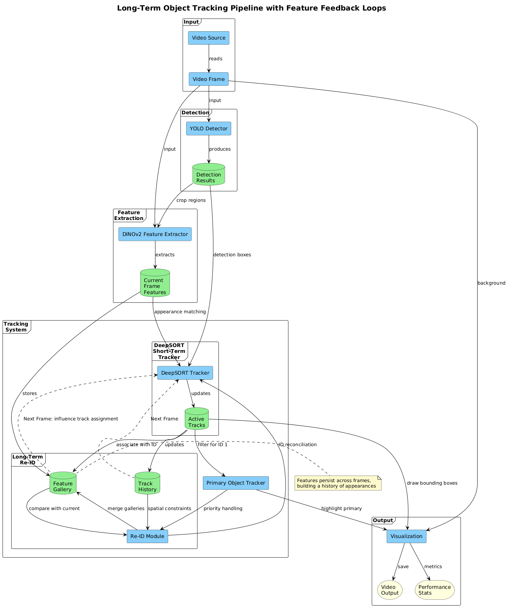

# Hybrid Long-Term Multi-Object Tracking (HLT-MOT)

## Overview

This project implements a robust multi-object tracking system designed to maintain consistent object identities over extended periods, particularly addressing challenges like occlusions and re-appearance. It combines the efficiency of short-term tracking with the discriminative power of deep learning-based re-identification (Re-ID).

**Core Functionality:**

1.  **Short-Term Tracking:** Utilizes DeepSORT (`deep_sort_realtime`) for frame-to-frame association based on motion (Kalman filter) and appearance similarity (DeepSORT's internal metric).
2.  **Appearance Embedding:** Employs DINOv2 ViT-B model (via PyTorch) to extract robust visual appearance features (768-dim embeddings) for each detected object, with ResNet50 as a fallback option.
3.  **Primary Object Focus:** Prioritizes tracking a single "primary" object (ID 1), which is typically the first detected object in the scene.
4.  **Online Re-Identification:** When a new track appears, its features are compared against a gallery of features from recently *inactive* tracks. If a strong match (low cosine distance) is found, the existing ID is reassigned, enabling tracking through short occlusions or detection failures.
5.  **Offline Re-Identification Refinement:** Periodically (every `re_id_interval` frames), the system compares active tracks with inactive ones. If strong appearance similarity suggests a fragmented track (same object assigned multiple IDs), the older ID is merged into the current active one, consolidating identity history.
6.  **Spatial-Temporal Consistency:** Uses both appearance similarity and spatial proximity to make more robust re-identification decisions, particularly for the primary object.

## How It Works

### Object Detection

Object detection is the first step in our tracking pipeline, using YOLOv8/YOLOv11 (You Only Look Once), which:

1. **Divides** the image into a grid (typically 13×13 or larger)
2. **Predicts** bounding boxes with confidence scores for each grid cell
3. **Applies** Non-Maximum Suppression (NMS) to remove overlapping detections

Each detection is represented as a vector `[x1, y1, x2, y2, confidence, class_id]`, where:
- `(x1, y1)` and `(x2, y2)` are the top-left and bottom-right coordinates
- `confidence` is the detection probability (0-1)
- `class_id` is the object category (e.g., 0 for person)

The system includes a fallback to a mock detector if YOLO initialization fails.

### Feature Extraction

For each detected object, we extract a unique visual signature using DINOv2 ViT-B/14:

1. **Crop** the detected object from the original frame
2. **Preprocess** with normalization: `(pixel - mean) / std` where `mean=[0.485, 0.456, 0.406]` and `std=[0.229, 0.224, 0.225]`
3. **Extract** a 768-dimensional feature vector using DINOv2
4. **Normalize** the vector to unit length (L2 normalization): 
   
```math
f_{normalized} = \frac{f}{||f||_2} = \frac{f}{\sqrt{f_1^2 + f_2^2 + \dots + f_{768}^2}}
```

This transforms each object into a compact "visual fingerprint" that captures its appearance while being robust to small changes in lighting, pose, or viewpoint.

If DINOv2 fails to load, the system falls back to a ResNet50 model which provides 2048-dimensional feature vectors.

### Primary Object Tracking

A unique aspect of this implementation is its focus on tracking a primary object (ID 1):

1. **Initialization:** The first detected object is assigned ID 1 and designated as the primary object.
2. **Dedicated Gallery:** The system maintains a separate feature gallery specifically for the primary object.
3. **Strict Re-ID:** Uses more stringent thresholds when re-identifying the primary object.
4. **Spatial Consistency:** Applies IoU (Intersection over Union) checks to ensure spatial consistency during re-identification.
5. **Visual Highlight:** The primary object is highlighted in the visualization with a distinct color.

This approach is particularly useful for applications where tracking one specific object consistently is more important than tracking all objects.

## Mathematical Components

### Intersection over Union (IoU)

IoU measures the overlap between two bounding boxes and is used for spatial consistency verification:

```math
IoU = \frac{\text{Area of Intersection}}{\text{Area of Union}} = \frac{\text{Area of Intersection}}{\text{Area}_1 + \text{Area}_2 - \text{Area of Intersection}}
```

Where:
- Intersection area = (right - left) × (bottom - top)
- Box areas = width × height for each box

This metric ranges from 0 (no overlap) to 1 (perfect overlap), and is used to verify that re-identified objects are spatially consistent with their previous locations.

### Short-term Tracking with DeepSORT

DeepSORT combines two key components to track objects between consecutive frames:

1. **Kalman Filtering** - A motion prediction algorithm that:
   - Maintains a state vector `x = [center_x, center_y, aspect_ratio, height, velocity_x, velocity_y, ...]`
   - Predicts future position using linear motion model: `x_predicted = F·x + noise`
   - Updates predictions based on new measurements: `x_updated = x_predicted + K·(measurement - H·x_predicted)`
   
   Here, `F` is the state transition matrix, `H` maps state to measurement space, and `K` is the Kalman gain that balances prediction vs. measurement.
   
   The core Kalman filter equations implemented in DeepSORT are:
   
   ```math
   \text{Prediction: } \mathbf{x}_{k|k-1} = \mathbf{F}\mathbf{x}_{k-1|k-1} + \mathbf{w}_k
   ```
   
   ```math
   \text{Update: } \mathbf{x}_{k|k} = \mathbf{x}_{k|k-1} + \mathbf{K}_k(\mathbf{z}_k - \mathbf{H}\mathbf{x}_{k|k-1})
   ```
   
   With the Kalman gain:
   ```math
   \mathbf{K}_k = \mathbf{P}_{k|k-1}\mathbf{H}^T(\mathbf{H}\mathbf{P}_{k|k-1}\mathbf{H}^T + \mathbf{R})^{-1}
   ```
   
   Where:
   - x_k is the state vector at time k
   - F is the state transition matrix
   - w_k is the process noise
   - z_k is the measurement
   - H is the measurement matrix
   - K_k is the Kalman gain
   - P is the error covariance matrix
   - R is the measurement noise covariance

2. **Data Association** - Matches detections to existing tracks using both motion and appearance:
   - Computes cost matrix `C` combining motion and appearance distances
   - For each element: `C[i,j] = λ·motion_distance + (1-λ)·appearance_distance`
   - Solves the assignment problem using the Hungarian algorithm (finding optimal pairing that minimizes total cost)

   The Hungarian algorithm solves the optimal assignment problem with the following mathematical formulation:

   ```math
   \min \sum_{i=1}^{n}\sum_{j=1}^{m} C_{i,j} \cdot x_{i,j}
   ```

   Subject to:
   ```math
   \sum_{j=1}^{m} x_{i,j} = 1 \text{ for all } i \in \{1,\ldots,n\}
   ```
   ```math
   \sum_{i=1}^{n} x_{i,j} \leq 1 \text{ for all } j \in \{1,\ldots,m\}
   ```
   ```math
   x_{i,j} \in \{0,1\}
   ```

   Where:
   - n is the number of tracks
   - m is the number of detections
   - C is the cost matrix
   - x_i,j = 1 if track i is assigned to detection j, 0 otherwise

This combination allows reliable frame-to-frame tracking under ideal conditions.

### Long-term Re-identification

When objects disappear and reappear (due to occlusion or leaving the frame), we need to recognize them:

1. **Feature Gallery** - For each tracked object, we maintain:
   - A queue of up to `gallery_size` (e.g., 3000) feature vectors from past appearances
   - Last seen frame information

2. **Online Re-ID** - When a new track appears:
   - Compare its feature vector against all feature galleries of inactive tracks
   - Compute cosine distance: `d = 1 - (feature1·feature2)/(||feature1||·||feature2||)`
   - If minimum distance < threshold (e.g., 0.15), assign the previous ID

   The cosine distance is calculated differently based on hardware availability:

   **For GPU calculation:**
   ```math
   \text{similarity} = \mathbf{features1_{norm}} \cdot \mathbf{features2_{norm}}^T
   ```
   ```math
   \text{distance} = 1 - \text{similarity}
   ```

   **For CPU/Numba calculation:**
   ```math
   \text{distance}_{i,j} = 1 - \frac{\sum_{k=1}^{d} \mathbf{features1}_{i,k} \cdot \mathbf{features2}_{j,k}}{\|\mathbf{features1}_i\|_2 \cdot \|\mathbf{features2}_j\|_2}
   ```

3. **Batch Re-ID Refinement** (every `re_id_interval` frames):
   - Compute distances between all active and inactive track galleries in a single GPU operation
   - Form a distance matrix `D` where `D[i,j]` is the minimum distance between features of active track `i` and inactive track `j`
   - Sort potential matches by increasing distance
   - Merge tracks if minimum distance < threshold (e.g., 0.2)
   - Apply additional spatial consistency checks using IoU between bounding boxes

   The batch distance matrix computation is represented as:
   ```math
   \mathbf{D} \in \mathbb{R}^{n \times m}, \text{ where } D_{i,j} = 1 - \frac{\mathbf{f}_i \cdot \mathbf{f}_j}{\|\mathbf{f}_i\|_2 \|\mathbf{f}_j\|_2}
   ```

   Where:
   - n = number of active track features
   - m = number of inactive track features
   - f = feature vectors

This allows objects to maintain consistent identity even after long periods out of view.

### Spatial-Temporal Consistency

To handle challenging cases, the system combines appearance similarity with spatial-temporal information:

1. **Track History** - Store the last 50 positions of each object
2. **IoU Checking** - Calculate overlap between bounding boxes to verify spatial consistency
3. **Motion Prediction** - Estimate future position based on recent velocities:
   - `velocity = positions[1:] - positions[:-1]`
   - `avg_velocity = mean(velocity)`
   - `predicted_position = last_position + avg_velocity`

   This simple motion model can be represented mathematically as:
   ```math
   \mathbf{v}_t = \mathbf{p}_t - \mathbf{p}_{t-1}
   ```
   ```math
   \mathbf{\bar{v}} = \frac{1}{T}\sum_{i=1}^{T}\mathbf{v}_{t-i+1}
   ```
   ```math
   \mathbf{\hat{p}}_{t+1} = \mathbf{p}_t + \mathbf{\bar{v}}
   ```

   Where:
   - p_t is position at time t
   - v_t is velocity at time t
   - T is the number of frames to consider for velocity estimation

4. **Spatial Distance** - Reject matches if objects are unreasonably far apart, using a distance threshold (e.g., 200 pixels)

These spatial constraints prevent ID switches between objects that look similar but are in different parts of the scene.

### Performance Optimization

The system uses several techniques to maintain real-time performance:

1. **Batch Processing** - Feature extraction for multiple objects in a single GPU operation
2. **GPU Acceleration** - Distance calculations for feature matching using CUDA operations
3. **Parallel Computing** - When appropriate, parallel processing of independent operations
4. **Numba Optimization** - Accelerated IoU and distance calculations using Numba when available
5. **Selective Update** - Motion predictions updated only for the primary object when optimizing for speed

## System Architecture Flow



For each frame:

1.  **Detect:** Objects are detected using an upstream detector (e.g., YOLOv8/YOLOv11 via `YOLODetector`).
2.  **Update DeepSORT:** Detections are passed to `deep_sort_realtime` for Kalman prediction and association based on motion/appearance.
3.  **Process Tracks:** Confirmed tracks from DeepSORT are processed.
4.  **Extract Features:** For relevant tracks, appearance features are extracted using the `FeatureExtractor` (DINOv2 or ResNet50).
5.  **Identify Primary Object:** The system prioritizes tracking the object with ID 1, applying stricter matching criteria.
6.  **Map IDs & Re-ID:**
    *   If a track ID is new from DeepSORT, attempt **Online Re-ID** against inactive track feature galleries.
    *   Assign a consistent system ID (either re-identified or new).
    *   For potential primary object candidates, verify with additional spatial consistency checks.
7.  **Update State:** Add current features to the track's gallery (`feature_gallery`), update last seen frame, and manage active/inactive status.
8.  **Offline Refinement (Periodic):** If `frame_count % re_id_interval == 0`, perform **Offline Re-ID Refinement** to merge fragmented tracks.
9.  **Predict Motion:** Update simple motion predictions primarily for the primary object.
10. **Output:** Return list of active tracks: `[x1, y1, x2, y2, consistent_id, class_id]`.

## Key Components

*   **`HybridTracker`:** Main class managing the overall tracking logic, integrating DeepSORT and the custom Re-ID mechanisms.
*   **`FeatureExtractor`:** Handles loading the DINOv2 ViT-B model (with ResNet50 fallback), image preprocessing (resize, normalize), and extracting L2-normalized feature embeddings using PyTorch.
*   **`YOLODetector`:** Wrapper for object detection (supports `ultralytics` YOLOv11+ or OpenCV DNN YOLOv4 as fallback).
*   **`deep_sort_realtime`:** External library providing the underlying DeepSORT algorithm.
*   **`numba_optimizations.py`:** Contains Numba-accelerated versions of common distance calculations.
*   **`profiling.py`:** Provides performance monitoring and statistics.
*   **`utils.py`:** Utility functions for video handling, visualization, and system configuration.

## Performance Profiling

The system includes built-in performance monitoring to identify bottlenecks:

1. **Function-level Profiling** - Measures execution time of key functions
2. **Bottleneck Analysis** - Identifies the most time-consuming operations
3. **Runtime Toggling** - Press 'p' during execution to toggle profiling output
4. **Profile Data Export** - Saves profiling statistics to files like `profiling_stats_YYYYMMDD_HHMMSS.prof`

Common bottlenecks include:
- Feature extraction (GPU memory transfers)
- Batch feature comparison during Re-ID
- YOLO detection on higher-resolution frames

## Dependencies

*   Python 3.7+
*   OpenCV (`opencv-python`)
*   NumPy
*   PyTorch (`torch`, `torchvision`)
*   SciPy
*   Pillow (`PIL`)
*   `deep_sort_realtime`
*   `ultralytics` (Optional, recommended for easy YOLO usage)
*   Numba (Optional, for optimized calculations)

Install using pip:

```bash
pip install opencv-python numpy torch torchvision scipy Pillow deep_sort_realtime ultralytics numba
```

## Configuration

Key parameters for `HybridTracker`:

*   `max_cosine_distance` (float, default: 0.15): DeepSORT's appearance threshold (lower = stricter match). With DINOv2 features, a lower value (0.15) works well.
*   `max_age` (int): Max frames DeepSORT keeps a track without association. *Crucial for occlusion handling.* (Dynamically calculated in `main()` based on FPS and target occlusion time - typically set to handle 10 second disappearances).
*   `min_confidence` (float, default: 0.3): Minimum detection confidence threshold.
*   `re_id_interval` (int, default: 1): How often (in frames) to run offline Re-ID refinement. The current implementation runs this every frame since DINOv2 provides efficient feature extraction.
*   `gallery_size` (int, default: 3000): Max features stored per track for custom Re-ID.
*   `iou_threshold` (float, default: 0.1): Threshold for spatial consistency check.
*   `model_path` (str | None): Optional path to a custom Re-ID model. Default uses DINOv2 ViT-B/14.

## Usage

1.  **Clone:** `git clone <repository-url> && cd <repository-directory>`
2.  **Install:** `pip install -r requirements.txt` (if provided, otherwise use the command above)
3.  **Setup:**
    *   Ensure YOLO model weights are available (e.g., `yolov11s.pt` will be downloaded by `ultralytics`) or configure paths in `YOLODetector`.
    *   Place your input video as `left_view.mp4` or modify `video_path` in `main()`. Webcam 0 is used if the file isn't found.
4.  **Run:** `python main.py`
5.  **Interact:**
    *   Press 'q' to quit the display window.
    *   Press 's' to toggle saving the output video to `output.avi`.
    *   Press 'p' to toggle per-frame profiling output.

## How the Re-ID Similarity Works: An Intuitive Explanation

When deciding if two object detections are the same object, the system calculates how "similar" they look using cosine similarity. Think of each object's feature vector as an arrow pointing in a specific direction in a high-dimensional space:

1. **Similar objects** have feature arrows pointing in nearly the same direction, resulting in a small angle between them (high cosine similarity, low distance).
2. **Different objects** have feature arrows pointing in different directions, resulting in a larger angle (low cosine similarity, high distance).

For example:
- If two detections of the same person wearing the same clothes have a cosine distance of 0.12 (very similar)
- Two different people might have a cosine distance of 0.75 (very different)
- The system uses a threshold (e.g., 0.15) to decide: "below this, I'm confident it's the same object"

The DINOv2 transformer-based architecture creates these feature vectors that are remarkably good at focusing on the important visual aspects while ignoring irrelevant variations.

## Limitations

*   **Computational Load:** Detection + DeepSORT + DINOv2 feature extraction is computationally demanding.
*   **Parameter Tuning:** Performance depends on careful tuning of `max_age`, distance thresholds, etc.
*   **Detector Reliant:** Tracking quality is capped by the upstream detector's performance.
*   **Appearance Similarity:** Very similar-looking objects (e.g., identical twins, same uniform) can still cause ID switches.
*   **Primary Object Bias:** The system prioritizes tracking the primary object (ID 1), which may result in less accurate tracking of other objects.
*   **Long-term Changes:** Objects that drastically change appearance over time may be difficult to re-identify.

## Potential Future Enhancements

*   Fine-tune the DINOv2 Re-ID model on domain-specific data (e.g., person or vehicle datasets).
*   Implement more advanced motion models (e.g., social force models for pedestrians).
*   Explore graph-based optimization for offline association.
*   Add camera-to-camera (multi-view) re-identification capabilities.
*   Incorporate scene context understanding for improved predictions.
*   Extend primary object tracking to handle multiple priority objects.
*   Add GPU-optimized implementations for more operations using CuPy or PyTorch.
